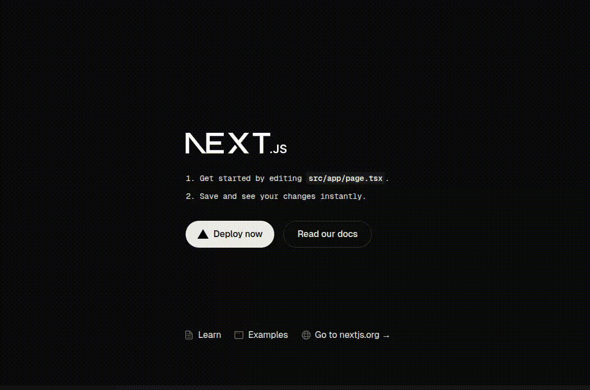

👆 Don't Touch Button DemoThis is a simple Next.js project demonstrating a button that you cannot click, featuring a playful custom animation on hover.Getting StartedFirst, run the development server to see the component in action

# or

yarn dev

# or

pnpm dev

# or

bun dev
Open http://localhost:3000 with your browser to see the result.You can start editing the page by modifying app/page.tsx. The page auto-updates as you edit the file.

